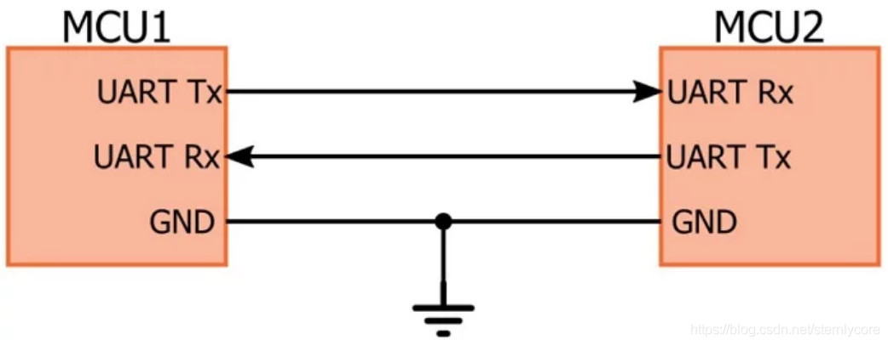
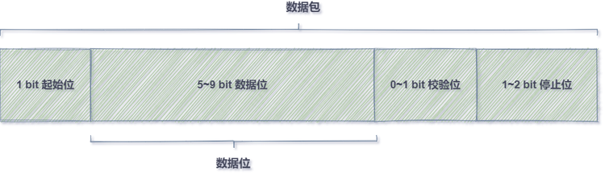
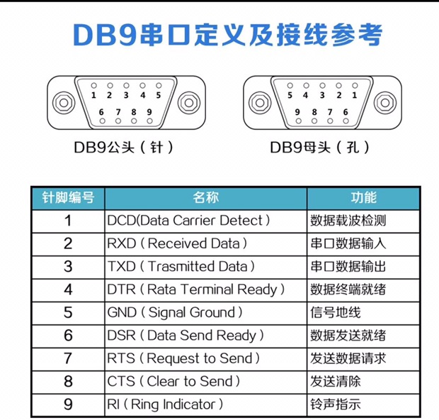
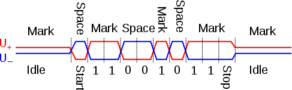

# UART

简介：UART是通用异步收发器（Universal Asynchronous Receiver/Transmitter）

关键词：串行、异步、全双工

## 1、硬件接口

四根线：电源（VCC+GND）+数据线（接收RX+发送TX）

连接方式：对端GND-GND、RX-TX、TX-RX实现全双工，如下图所示

 

## 2、通信协议详述

串行：数据按位依次传输。具有线路少、传输远的特点。

异步：没有CLK时钟线。收发双方约定好协议：传输速率、空闲位、起始位、校验位、结束位

串行异步通信：按位传输数据，单字符的传输过程要求一致（要求收发方具有相同的传输协议），但是字符间的传输间隔（空闲状态）没有要求。

比特率：bitrate,单位时间传输的bit位数，单位为bps 

波特率：baudrate,单位时间内调制的信号元素数，单位为Baud 波特，表征工作频率。当信号的状态只包含两种状态（0/1），这时候在数值上波特率=比特率。常见的波特率有：9600、115200、2400及其倍数。UART在接收数据的时候，以波特率的频率读取数据线上的每一位数据。

### 2.1 帧结构

如图所示，UART的帧结构主要分为四个部分：起始位、数据位、校验位停止位

- 起始位：1bit ，逻辑0
- 数据位：典型值5-8位，无校验可9位。**LSB** first,低位在前
- 校验位：0/1 bit.无校验、奇/偶校验：对于1的个数判断奇偶，真为**0**。例如：01001101=》$\cases{奇校验：1\\偶校验：0}$
- 停止位：1、1.5、2bit，逻辑1。表示数据包传输结束。提供传输方、接收方始终校正的机会。停止位越长，容错率越高
- 空闲位：逻辑1,表示目前线路无数据传输

典型用语：8n1,表示数据位为8bit,不校验，停止位为1bit

### 2.2 常见串口知识

电平

- TTL电平：直接兼容单片机、soc电平
  - 逻辑0：0～0.7 V
  - 逻辑1：3～3.3 V
  - 硬件电路UART接口：4针杜邦头
- RS-232：EIA指定的传输标准接口
  - 逻辑0：+5～+15 V
  - 逻辑1：-5～-15 V
  - 硬件电路：通常使用DB9接口
  -  

232协议层面两者是一致的区别在于逻辑0/1的电压不一致

- RS-232：全双工，DB9连接2、3、5pin
  - max：20Kbps
- RS-485：半双工，差分信号传输（压差判断逻辑0/1：$\pm (2 \sim 6)$）。
  - 一般没有固定接线，通常为3-A、8-B
  - 典型图像
  - 接线：A-A、B-B
  - max：10Mbps
- RS-422：全双工，RS-485的升级，使用两对差分信号，实现全双工。
  - 接线：R_A-T_B 、R_B-T_A
  - max：10Mbps

## 3、典型过程

- 发送端FIFO读取数据，进行并-串转换=》组合成符合协议的位流：起始位0 | LSB 数据位 | 校验位 | 停止位
-  接收端检测到有效的起始脉冲（从逻辑1到逻辑0），接收数据流进行串-并转换，进行错误检验
- 数据写入FIFO，接着使能UART，BUSY有效，发送端开始发送数据，FIFO为空时发送停止，BUSY无效，UART失能

 

 

